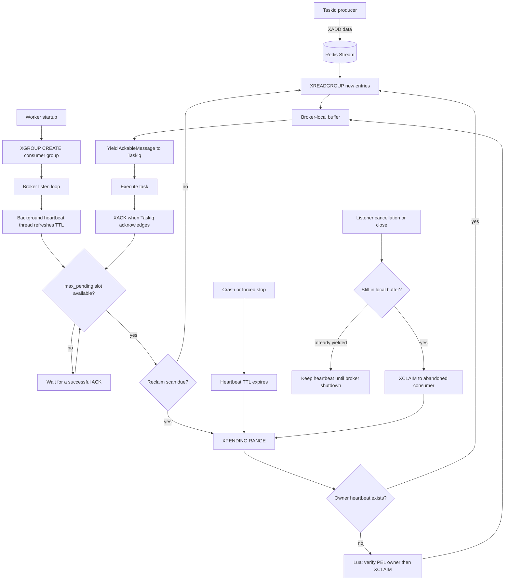

# taskiq-redis-streams

[中文文档](README.zh-CN.md)

An independent, single-node Redis Streams broker for
[Taskiq](https://taskiq-python.github.io/). It uses bounded local prefetch and
consumer-heartbeat pending-entry recovery.

Redis Streams delivery is at least once. A task can execute more than once
after a worker crash or failed acknowledgement, so handlers must be idempotent.

## Installation

```bash
uv add taskiq-redis-streams
```

## Usage

```python
from taskiq_redis_streams import RedisStreamsBroker

broker = RedisStreamsBroker(
    "redis://localhost:6379/0",
    queue_name="default",
    namespace="my-service",
)


@broker.task
async def process_order(order_id: str) -> None:
    # Make this operation idempotent.
    ...
```

```bash
taskiq worker my_app:broker
```

The consumer group always starts at `0`, so tasks published before the first
worker starts are consumed.

## Features

- One namespaced Redis Stream and consumer group per Taskiq queue.
- At-least-once delivery through Redis Streams consumer groups; task handlers
  must be idempotent.
- Bounded broker-local prefetch: `max_pending` caps fetched-but-unacknowledged
  entries per listener.
- Consumer-heartbeat recovery: live workers can run arbitrarily long tasks
  without recovery being tied to a task execution timeout.
- Atomic orphan reclaim: Redis verifies that the PEL owner is unchanged and
  its heartbeat is absent before `XCLAIM` transfers an entry.
- A dedicated heartbeat thread and Redis connection to keep liveness renewal
  independent from ordinary event-loop stalls and blocking `XREADGROUP` calls.
- Fast listener-close handoff: entries still buffered inside the broker move to
  an internal `abandoned` consumer and are reclaimable immediately.
- Retryable Redis listener errors use exponential backoff; Taskiq cancellation
  is propagated so shutdown handoff still runs.

## Delivery and Recovery Flow



## Behavior

One broker instance serves one Taskiq queue and uses these namespaced keys:

```text
<namespace>:stream:<queue_name>
<namespace>:workers:<queue_name>
<namespace>:heartbeat:<queue_name>:<consumer_name>
```

Use a distinct `namespace` for applications that share Redis. The default is
`taskiq`.

Each broker instance generates its own Redis consumer name. Consumer names are
not configurable, so a restarted worker receives a new identity. Active worker
consumers renew a Redis TTL heartbeat and pending entries owned by a consumer
whose heartbeat has expired are eligible for recovery.

`max_pending` caps entries fetched by a listener but not successfully
acknowledged; it defaults to `10`. Once the cap is reached, the listener leaves
new work for other consumers. Set `max_pending=1` to reserve one task at a time,
or `max_pending=None` to disable the local cap. Redis reads use an internal
batch size of at most `10`, always bounded by the remaining `max_pending`
capacity. Empty reads use an internal `3000` ms Redis long-poll timeout.

When `maxlen` is set, producers use Redis's approximate `XADD MAXLEN ~`
trimming to control Stream history. Choose it conservatively: trimming can
remove entries that have not yet been processed.

`max_connection_pool_size` applies to task delivery commands. The broker keeps
one separate Redis connection in a heartbeat thread, so a blocking read or an
ordinary event-loop stall does not starve consumer lease renewal.

The broker scans the consumer group's PEL periodically. It renews each active
consumer's heartbeat every `consumer_heartbeat_interval` milliseconds (default
`10000`). A heartbeat remains live for `consumer_heartbeat_ttl` milliseconds
(default `60000`) after its most recent successful refresh. PEL scans run every
`reclaim_interval` milliseconds (default `10000`). Once that lease expires, the
next PEL scan claims entries from that consumer. `XCLAIM` is
guarded by an atomic Redis heartbeat check, so concurrent workers cannot both
recover the same entry. Configure a TTL longer than the renewal interval to
allow for normal scheduling and Redis latency. Reclaimed entries are handled
before new entries when a scan is due.

The heartbeat represents worker-process liveness, not task completion. A host
pause or network partition can still let the lease expire while a task resumes
later, so task handlers must remain idempotent.

Taskiq's `timeout` label still controls task execution time, but it does not
control Redis Streams recovery. A live worker can therefore run long tasks
without their PEL entries being reclaimed solely because of task duration.

On listener close, only messages still in the broker-local buffer are handed to
an internal `abandoned` consumer and become reclaimable immediately. Already
yielded messages may be executing. Their worker heartbeat remains active until
broker shutdown, allowing Taskiq to drain them without a duplicate reclaim.

Retryable Redis errors while listening are retried with exponential backoff from
100 ms to 5 seconds. Cancellation from Taskiq is never retried; it propagates
into the listener so the normal listener-close handoff can run.

Redis Cluster, Sentinel, delayed tasks, and a stream-level dead-letter queue
are not part of the first release.

## Development

Tests clear a dedicated Redis database before and after every test:

```bash
TEST_REDIS_URL=redis://127.0.0.1:7000/14 uv run pytest -q
```

Do not point `TEST_REDIS_URL` at a database containing application data.

```bash
uv sync --all-groups
uv run ruff check .
uv run mypy
uv run pytest -q
```

## Inspiration

The Taskiq integration follows ecosystem patterns from
[taskiq-redis](https://github.com/taskiq-python/taskiq-redis). Recovery, local
prefetch, and shutdown handoff are informed by
[dramatiq-redis-streams](https://github.com/sylvinus/dramatiq-redis-streams).

This project is independently maintained and is not affiliated with either
upstream project.
