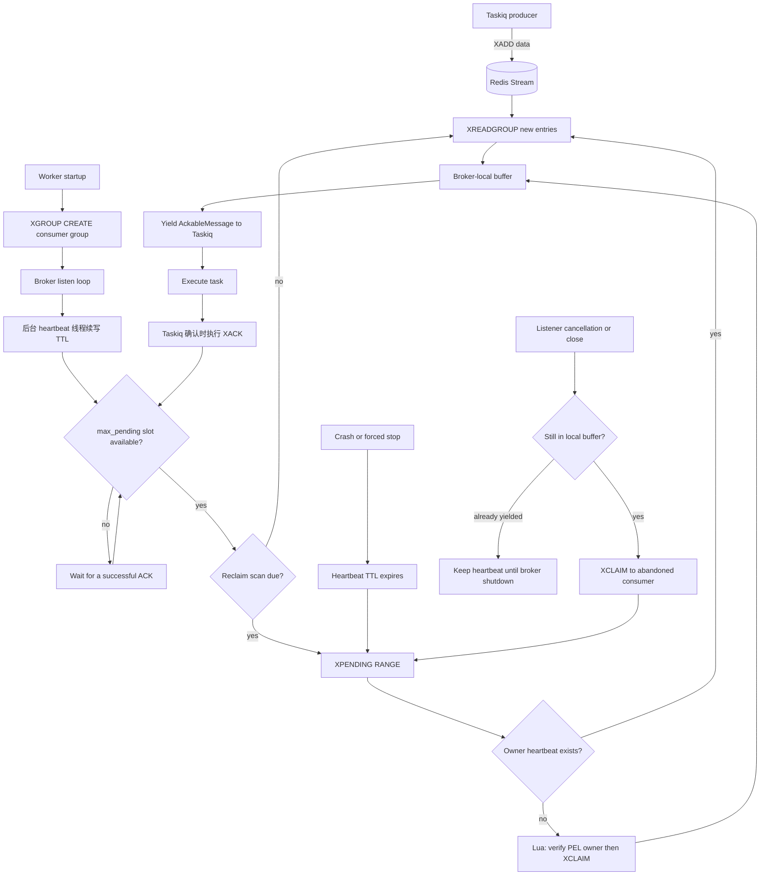

# taskiq-redis-streams

[English](README.md)

一个独立维护的单节点 Redis Streams [Taskiq](https://taskiq-python.github.io/)
broker，提供受限的本地预取和基于 consumer heartbeat 的 PEL 恢复机制。

Redis Streams 提供的是至少一次投递语义。worker 崩溃或确认失败后，任务可能
会执行多次，因此任务处理函数必须是幂等的。

## 安装

```bash
uv add taskiq-redis-streams
```

## 使用方法

```python
from taskiq_redis_streams import RedisAsyncResultBackend, RedisStreamsBroker

redis_url = "redis://localhost:6379/0"

result_backend = RedisAsyncResultBackend(
    redis_url,
    result_ex_time=3600,
    prefix_str="my-service:result",
)

broker = RedisStreamsBroker(
    redis_url,
    queue_name="default",
    namespace="my-service",
).with_result_backend(
    result_backend,
)


@broker.task
async def process_order(order_id: str) -> None:
    # 此操作需要保持幂等。
    ...
```

```bash
taskiq worker my_app:broker
```

consumer group 固定从 stream offset `0` 开始，因此第一个 worker 启动前已经
发布的任务也会被消费。

## 特性

- 每个 Taskiq queue 使用一个带命名空间的 Redis Stream 和 consumer group。
- 基于 Redis Streams consumer group 提供至少一次投递语义，任务处理必须幂等。
- 受限的 broker 本地预取：`max_pending` 限制每个 listener 已拉取但尚未确认的
  entry 数量。
- 基于 consumer heartbeat 的恢复机制：存活 worker 可执行任意时长的任务，恢复
  不依赖任务执行超时。
- 原子 orphan reclaim：Redis 会确认 PEL owner 未变化且 heartbeat 不存在后，才通过
  `XCLAIM` 转移 entry。
- heartbeat 使用独立线程和 Redis 连接，使其独立于普通的 event loop 停顿和任务投递
  连接池受限时的 `XREADGROUP` 阻塞。
- listener 关闭时，仍在 broker 本地 buffer 中的 entry 会交接到内部 `abandoned`
  consumer，并可被立即恢复。
- 可重试的 Redis listener 错误使用指数退避；Taskiq 取消会向上传播，确保关闭时的
  消息交接逻辑能够执行。
- Redis result backend：支持可选 TTL、进度保存、一次性读取和可配置 key 前缀。

## 投递与恢复流程



## 行为说明

每个 broker 实例服务于一个 Taskiq queue，并使用以下带命名空间的 Redis key：

```text
<namespace>:stream:<queue_name>
<namespace>:workers:<queue_name>
<namespace>:heartbeat:<queue_name>:<consumer_name>
```

多个应用共用同一个 Redis 时应使用不同的 `namespace`。默认值为 `taskiq`。

每个 broker 实例都会生成独立的 Redis consumer 名称，且不支持配置。worker
重启后会使用新的身份。活跃 worker consumer 会续写 Redis TTL heartbeat；owner
heartbeat 已过期的 pending entry 会进入恢复流程。

`max_pending` 限制一个 listener 已拉取但尚未成功确认的 entry 数量，默认是
`10`。达到上限后，listener 不会继续占用新的 stream entry，从而让同一 group 中的
其他 consumer 有机会获取任务。设置 `max_pending=1` 可一次只占用一个任务；设置
`max_pending=None` 可关闭这一项本地限制。Redis 单次读取使用内部 `10` 条上限，但
始终会受剩余 `max_pending` 容量限制；空队列读取使用内部 `3000` 毫秒的 Redis 长轮询
超时。

设置 `maxlen` 时，producer 会使用 Redis 近似的 `XADD MAXLEN ~` 修剪来限制
Stream 历史长度。应保守设置：修剪可能删除尚未处理完成的 entry。

## Result Backend

`RedisAsyncResultBackend` 是通过 Taskiq `with_result_backend(...)` API 使用的
单节点 Redis result backend。它会将序列化后的结果和进度分别存储在
`<prefix_str>:<task_id>` 与 `<prefix_str>:<task_id>__progress`。
为了兼容 `taskiq-redis`，未设置 `prefix_str` 时 task ID 本身就是 Redis key；多个
服务共用 Redis 时应设置不同前缀。

设置 `result_ex_time`（秒）或 `result_px_time`（毫秒）中的一个，可同时为结果和
进度设置过期时间；二者均未设置时会永久保存。`keep_results=False` 会在第一次
`get_result()` 时原子地消费结果。长期运行的部署应设置 TTL，避免 Redis 存储无限增长。

`max_connection_pool_size` 只限制任务投递相关命令使用的连接。broker 会在独立线程中
使用额外的 Redis 连接续写 heartbeat，因此阻塞读取或普通 event loop 停顿不会饿死
consumer lease 的续写。

broker 会定期扫描 consumer group 的 pending entries list (PEL)。每个活跃
consumer 会按 `consumer_heartbeat_interval`（默认 `10000` 毫秒）续写 heartbeat。
每次成功续写后，heartbeat 在 `consumer_heartbeat_ttl`（默认 `60000` 毫秒）内
保持有效；PEL scan 按 `reclaim_interval`（默认 `10000` 毫秒）执行。租约过期后，
下一次 PEL scan 会恢复该 consumer 的 entry。`XCLAIM` 前会在 Redis 内原子检查
heartbeat，因此并发 worker 不会同时恢复同一条 entry。TTL 应大于续写间隔，以容纳
正常的调度延迟和 Redis 网络延迟。reclaim scan 到期时，已恢复的 entry 会优先于
新消息处理。

heartbeat 表示 worker 进程存活，而不是任务已经完成。宿主机暂停或网络分区仍可能让
lease 在任务稍后恢复执行前过期，因此任务处理仍必须保持幂等。

Taskiq 的 `timeout` label 仍控制任务执行时限，但不再控制 Redis Streams 恢复。
因此活跃 worker 可以执行长任务，而不会仅因任务持续时间过长就被 reclaim。

listener 关闭时，只有仍在 broker 本地 buffer 内、尚未 yield 给 Taskiq 的消息
会被交接给内部 `abandoned` consumer，并立即具备被下次 recovery scan 恢复的
资格。已经 yield 的消息可能正在执行；其 worker heartbeat 会持续到 broker
shutdown，从而允许 Taskiq drain 这些任务而不会发生重复 reclaim。

listener 遇到可重试的 Redis 错误时，会从 100 ms 到 5 秒进行指数退避重试。
Taskiq 的取消不会进入重试，而是向上传播，以便正常执行 listener 关闭时的消息交接。

首个版本暂不支持 Redis Cluster、Sentinel、延迟任务和 stream 级死信队列。

## 开发

测试会在每个测试前后清空指定的 Redis database：

```bash
TEST_REDIS_URL=redis://127.0.0.1:7000/14 uv run pytest -q
```

不要将 `TEST_REDIS_URL` 指向包含应用数据的 database。

```bash
uv sync --all-groups
uv run ruff check .
uv run mypy
uv run pytest -q
```

## 参考

Taskiq 集成遵循 [taskiq-redis](https://github.com/taskiq-python/taskiq-redis)
的生态模式。任务恢复、本地预取和关闭时消息交接的设计参考了
[dramatiq-redis-streams](https://github.com/sylvinus/dramatiq-redis-streams)。

本项目独立维护，与上述两个上游项目没有隶属关系。
